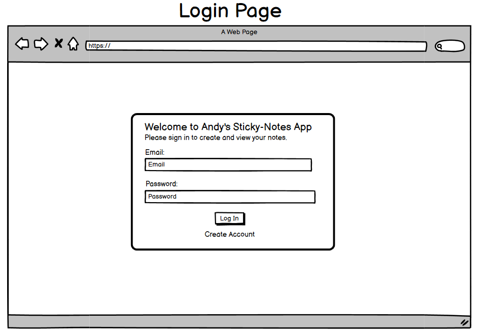
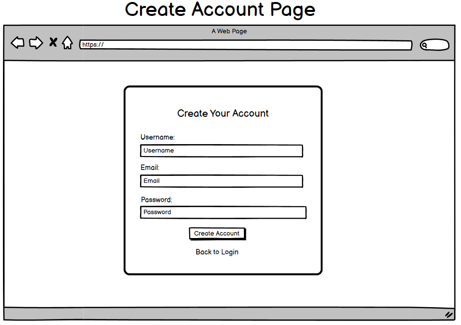
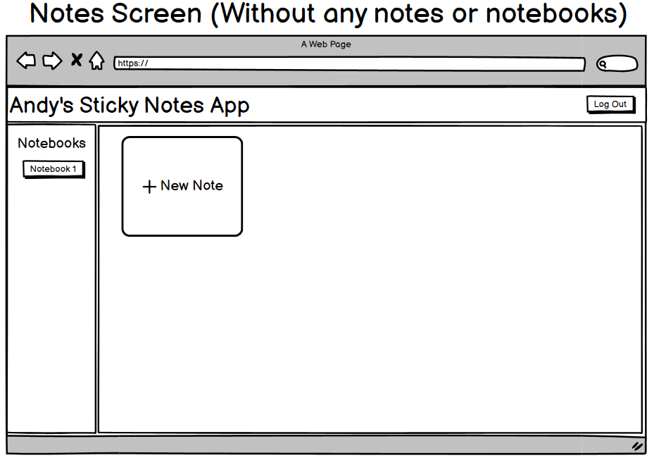
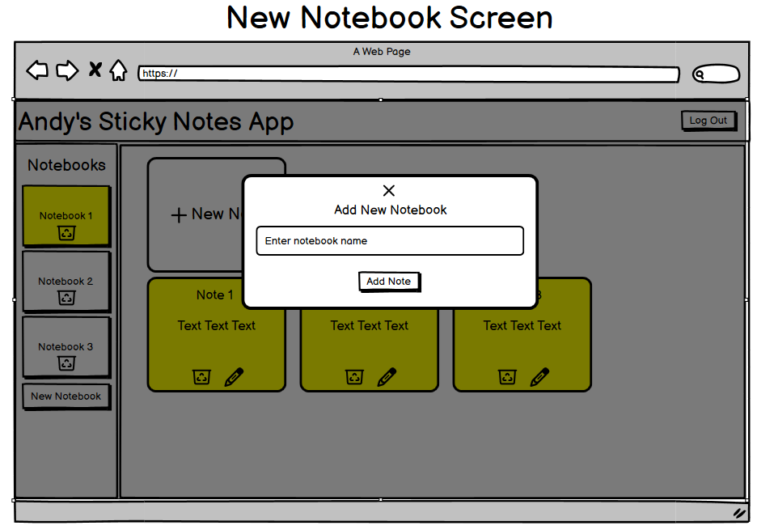
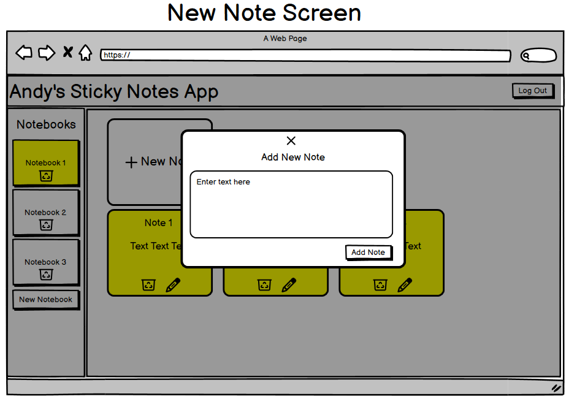
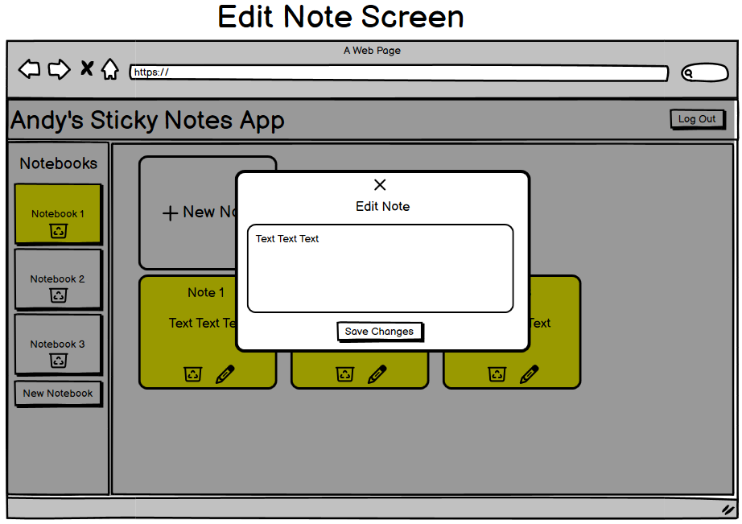
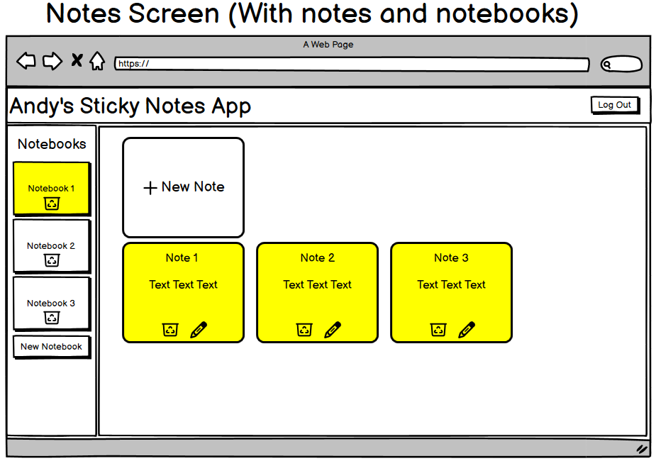
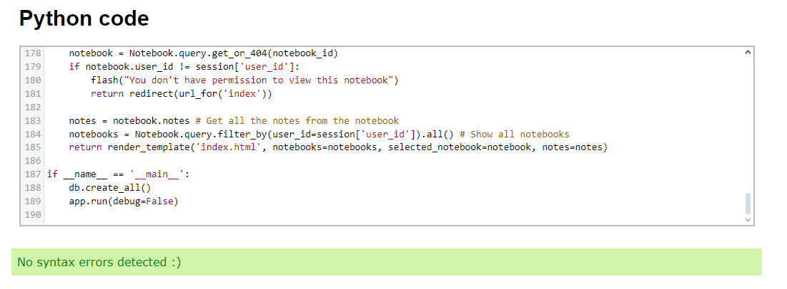

# Andy's Sticky Notes App

[Link to app via Heroku](https://andys-notes-app-7ac833b02c5c.herokuapp.com/)

## Table of Contents

-   [Introduction](#introduction)
-   [Features](#features)
-   [Planned Features](#planned-features)
-   [Wireframes](#wireframes)
-   [Testing](#testing)
-   [Validation](#validation)
-   [Bugs](#bugs)
-   [User Stories](#user-stories)
-   [Technologies Used](#technologies-used)
-   [Installation](#installation)
-   [Data Schema](#data-schema)
-   [Database Setup](#database-setup)
-   [Running the App](#running-the-app)
-   [Deployment](#deployment)
-   [Credits](#credits)

## Introduction

**Andy's Sticky Notes App** allows users to create an account and create multiple notes and notebooks for anything they need. They can Create, Read, Update and Delete (CRUD) the notes and their content and their data is saved to their account so they can access these notes from any device. This app is designed for users who like to write things down for later use. Many phones offer a notes app similar to this one, however they are not accessible on other devices e.g. iPhone notes cannot be accessed from a Windows PC. This Notes app solves that problem as it is a web based application so it can be accessed on any device with an internet connection. The users can store their notes in a clear and easy method and constantly create/read/update/delete them whenever they choose to do so.

## Features

1.  **User Accounts**: Create and manage individual user accounts.
2.  **Notebooks**: Each user can create multiple notebooks.
3.  **Sticky Notes**: Add, edit, and delete notes within each notebook.
4.  **Responsive Design**: Styled to resemble sticky notes on a page.
5.  **Authentication**: Secure login and session management.
6.  **PostgreSQL Integration**: All user and note data is stored in PostgreSQL.

## Planned Features

1. Some form of sorting/searching mechanic to be able to sort your notes/notebooks in a certain order and be able to search for a specific word/name of a note
2. Ability to add a title to each note
3. Ability to edit the name of the notebook
4. Potential light/dark mode switch
5. Improvements to login page e.g. confirmation message for account creation etc.
6. New page with general info on the app and the development. Add this as a link in the Navbar
7. Account info section - ability to change password/email/delete account

## Wireframes










## Testing

### Manual Testing

Manual testing was performed throughout the development of the app to ensure that all core functionalities were working as expected. Here’s a breakdown of the tested features:

#### **User Authentication**
- **Creating Account**: Made sure users can create an account with valid credentials.
    - Tested inputting valid and invalid information to ensure error messages are displayed when necessary.
- **Login**: Tested login with correct and incorrect credentials.
    - Verified that the session starts correctly and users are redirected to the correct page after logging in.
- **Log Out**: Confirmed that users are logged out and redirected to the login page.
    - Tested that the session is properly cleared upon logout.

#### **Notebooks**
- **Creating Notebook**: Verified that users can create notebooks.
    - Ensured notebooks appeared in the sidebar after clicking the create notebook button.
    - Verified the notebook had the corerct name which the user inputted.
- **Switching Between Notebooks**: Ensured that clicking on a notebook switches the displayed notes.
    - Verified that only notes from the selected notebook are displayed.
- **Deleting Notebook**: Ensured that a notebook can be deleted and that all notes within that notebook are also removed.

#### **Notes**
- **Creating Note**: Verify that notes can be added to any notebook.
    - Ensured that the notes are saved under the correct notebook.
- **Editing Note**: Checked that notes can be edited after being created.
- **Deleting Note**: Confirmed that notes can be deleted and that they no longer appear in the notebook.

#### **Database**
- **Data Persistence**: Ensured that user data, notebooks, and notes are stored in the PostgreSQL database.
    - Tested by logging in with the same account after logging out to ensure the same notebooks and notes are accessible.
    - Tested same account on different devices and browsers to ensure data was correct across multiple browsers.

## Validation
- All Python code checked in a [validator](https://extendsclass.com/python-tester.html) and returns no issues



## Bugs
1. Unable to edit a note if you press 'enter' while typing the note e.g. going to a new line

## User Stories

-   **As a new user**, I want to create an account so I can create some notes.
-   **As a returning user**, I want to utilise the notebooks to create and organise multiple notes. I want my data to be securely stored and accessible only by me.
-   **As a frequent user**, I want to have easy access to all of my notes from any device. I want to be easily able to see my different notebooks and be able to edit my existing notes.

## Technologies Used

-   **Flask** - Python micro web framework
-   **PostgreSQL** - Relational database
-   **Flask-SQLAlchemy** - Object-Relational Mapping for managing database operations
-   **Flask-Login** - User session management
-   **HTML5 & CSS3** - Structure and design
-   **JavaScript** - Frontend interactivity
-   **Heroku** - Deployment platform

## Installation

### Prerequisites

Ensure that the following software is installed on your machine:

-   [Python 3.9+](https://www.python.org/downloads/)
-   [PostgreSQL](https://www.postgresql.org/download/)
-   [Git](https://git-scm.com/)
-   [Heroku CLI](https://www.heroku.com)

### Step-by-Step Setup

1.  **Clone the repository:**
    
    ```
    git clone <repository-url>
    cd New Notes App
    ``` 
    
2.  **Set up a virtual environment:**

    
    ```
    python -m venv venv
    source venv/bin/activate  # On Windows: venv\Scripts\activate
    ``` 
    

3.  **Install the required packages:**
    
    ```
    pip install -r requirements.txt
    ``` 
    
4.  **Set up environment variables**:
    
    Create a `.env` file in the root of the project with the following:
    
    ```
    SECRET_KEY='your-secret-key'
    DATABASE_URL='postgresql://<user>:<password>@<host>:<port>/<database_name>'
    ``` 
    
## Data Schema

This notes app stores information in a database to keep track of users, notebooks, and the notes within those notebooks. The database is set up in a way that each user has their own notebooks, and each notebook contains notes. Below is an explanation of how the data is organized:

### 1. **User Table**
This table holds information about each person who uses the app. It keeps track of their username, email, and password.

| Field Name | Type     | Description                    |
|------------|----------|--------------------------------|
| id         | Integer  | A unique ID for each user (Primary Key) |
| username   | String   | The username chosen by the user |
| email      | String   | The user’s email address (must be unique) |
| password   | String   | The user’s password (stored securely) |

- Each user can create many notebooks that are unique to that user.

### 2. **Notebook Table**
This table stores the notebooks created by the users. Each notebook belongs to one user, but a user can have many notebooks.

| Field Name | Type     | Description                    |
|------------|----------|--------------------------------|
| id         | Integer  | A unique ID for each notebook (Primary Key) |
| name       | String   | The name of the notebook        |
| user_id    | Integer  | A reference to the user who owns the notebook (Foreign Key) |

- This table is linked to the **User Table** by the user_id, meaning each notebook belongs to a specific user.

### 3. **Note Table**
This table stores individual notes that are added to the notebooks. Each note belongs to one notebook, but a notebook can contain many notes.

| Field Name | Type     | Description                    |
|------------|----------|--------------------------------|
| id         | Integer  | A unique ID for each note (Primary Key) |
| content    | Text     | The text of the note itself     |
| notebook_id| Integer  | A reference to the notebook that this note belongs to (Foreign Key) |

- This table is linked to the **Notebook Table** by the notebook_id, meaning each note is part of a specific notebook.

### Relationships
- **User and Notebook**: Each user can create many notebooks. The link between the **User** and **Notebook** tables is through the `user_id`, which tells the app which user owns each notebook.
- **Notebook and Note**: Each notebook can have many notes. The **Notebook** and **Note** tables are linked through the `notebook_id`, which tells the app which notebook the note belongs to.

## Database Setup

1.  **Create the PostgreSQL database:**
    
    Log into PostgreSQL and create the database for the app:
    
    ```
    psql
    CREATE DATABASE your_database_name;
    ``` 
    
2.  **Initialize the database:**
    
    Run the following commands to set up the migrations and apply them:
    
    ```
    flask db init
    flask db migrate -m "Initial migration"
    flask db upgrade
    ``` 
    

## Running the App

To run the application locally, use the following command:

`flask run` or `python app.py`

The app will be accessible at `http://127.0.0.1:5000/`.

## Deployment

The app is designed to be deployed to Heroku. Follow these steps to deploy it:

1.  **Log in to Heroku:**
    
    `heroku login` 
    
2.  **Create a Heroku app:**
    
    `heroku create [your-app-name]` 
    
3.  **Add PostgreSQL to your app:**
        
    `heroku addons:create heroku-postgresql:hobby-dev` 
    
4.  **Deploy the app:**
    
    `git push heroku master` 
    
5.  **Migrate the database on Heroku:**
    
    `heroku run flask db upgrade` 
    
6.  **Open the app:**
    
    `heroku open` 
    

## Credits

Throughout this project, I relied heavily on Google for assistance with my code. The main places I used were [Stack Overflow](www.stackoverflow.com), [W3Schools](https://www.w3schools.com/python/), [MDN](https://developer.mozilla.org/en-US/), [Python Beginners](https://python-adv-web-apps.readthedocs.io/en/latest/index.html#), various [Reddit](www.reddit.com) pages, and also various Developer Discord servers which I am a member of. These have been an immense help with this project and all played a part at some point to get me unstuck with a problem I had encountered.

Special mention to these YouTube videos by [Devression](https://www.youtube.com/watch?v=3xFb7Ldaa4Q) and [codewithsadee](https://www.youtube.com/watch?v=aKP5610AEM4) for the inspiration for this app including CSS styling and also general ideas e.g. the yellow sticky note appearance and the sidebar with notebooks.